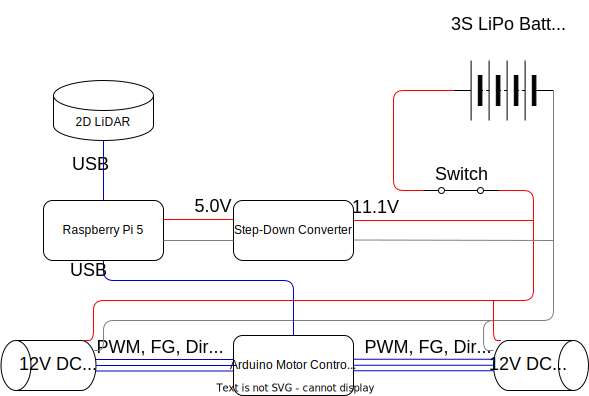

# Raspberry Pi Robot with LEGO Chassis and 2D LiDAR (WIP)

## 1 Overview

## 2 Electronics

This video shows all the electronics wired up and laid out before I packed them into the robot body. The rest of this section covers the design considerations for electronics and wiring.

<video src="https://github.com/user-attachments/assets/14b72ad6-245e-4bf9-bed6-f9f676e11a64" autoplay loop muted playsinline controls></video>

### 2.1 Electrical Schematic

I made the electrical schematic below to have a clear idea of how the components had to be wired up, and to correctly size the wires connecting them. 



It is almost an exact representation of the previous video showing the circuit, with a slight difference in the LiDAR connection. After filming the video, I found that the RPi didn't like the spikes in current drawn by the LiDAR through its USB port, so I made the LiDAR draw 5V from the step-down converter instead.

### 2.2 Major Components

To size the battery, fuse, and wires, first I needed to understand the operating voltages and current draw of the components in the circuit.

| Component      | Operating Voltage | Max Current  |
|----------------|-------------------|--------------|
| Raspberry Pi 5 | 5V                | 5A           |
| [2D LiDAR](https://www.waveshare.com/wiki/D200_LiDAR_Kit)       | 5V                | 0.3A         |
| Arduino Nano Motor Controller  | 5V                | 0.1A (est)   |
| [L298N Motor Driver](https://components101.com/modules/l293n-motor-driver-module)   | 5V                | 0.04A    |
| [60rpm DC Motors](media/motor_specs.png)      | 12V               | 0.6A (stall) |

Assumptions made:
- We will conservatively use the stall current instead of rated current for the DC motors.
- It's unlikely that the RPi 5 will be maxing out at 5A, so we are being conservative here as well.
- We assume that the L298N motor driver's max current draw of 0.04A from the Arduino as negligible and ignore it.
- To simplify calculations, we ignore all power losses in the wiring, step-down converter etc. We should have some buffer from the above assumptions.

### 2.3 Wiring and Fuse Sizing

The numbers calculated below were shown in the schematic earlier and used to determine the AWG sizes of the wires. 

- Current into the RPi at 5V: 
    ```
    5A (RPi) + 0.1A (Arduino) = 5.1A
    ```
- Current drawn from step-down converter to motor driver at 11.1V:
    ```
    2 * 0.6A (stall current of motor) = 1.2A
    ```
- Current drawn by LiDAR at 5V:
    ```
    0.3A
    ```
- Current drawn from battery to step-down converter at 11.1V, assuming no losses:
    ```
    (11.1V * 1.2A + 5V * 5.1A + 5V * 0.3A) / 11.1V = 3.6A
    ```

To prevent the risk of short circuits, I added a 10A mini blade fuse after the battery. 10A is sufficiently higher than 3.6A to not trip the circuit in the event of momentary surges.


### 2.4 Battery Sizing

I chose a 3 cell (3S) LiPo battery because it provides a voltage of 11.1V which is close to the 12V required by the DC motors. The step-down converter can step down the voltage to 5V for the rest of the circuit.
- Assuming we want the robot to run for 30 mins:
    ```
    Battery capacity = 3.6A*1000*30/60 = 1800mAh
    ```

I decided to use this [2200mAh battery](https://www.overlander.co.uk/catalog/product/view/id/1771/s/2200mah-3s-11-1v-25c-lipo-battery-xt60-overlander-sport/category/442/).

- It has a constant discharge of 25C which provides ample current for the circuit:
    ```
    Constant drawable current = 25C*2200mAh = 55A > 3.6A
    ```

### 2.5 Arduino and Motor Driver Connections

TO-DO

